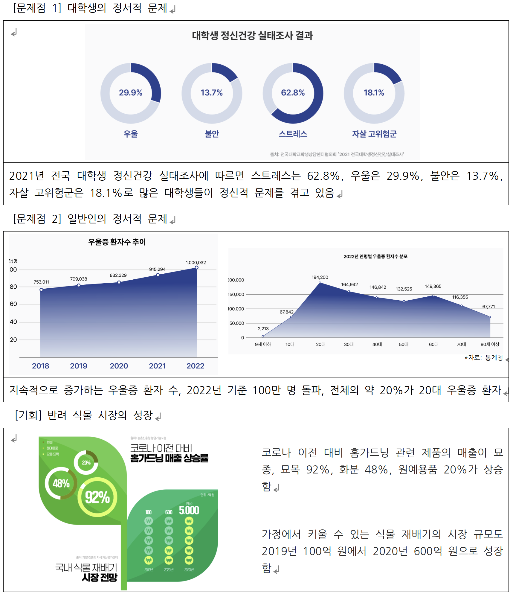

### 1. 프로젝트 소개
#### 1.1. 개발배경 및 필요성
- **개발 배경**

- 1. 외부적 배경
  
- 2. 내부적 배경
 - <현대인의 스트레스, 낮은 자존감 문제> 주변의 많은 친구들과 직장인들이 학업, 직장으로 인한 스트레스와 낮은 자존감으로 많은 문제를 겪고 있음
 - <현대인의 외로움 및 우울증 문제> 본인을 비롯한 많은 친구들이 타지 생활의 외로움으로 인해 정서적으로 문제를 겪은 경험이 존재하며 친구들과 이 주제로 이야기를 나눈 적도 있음
<br>

- **개발 필요성**
    > “마이 포레스트”는 정서적으로 문제를 겪는 현대인들에게 일상 속에서 자연스럽게 실질적인 도움을 줄 수 있는 혁신적인 마음 건강을 위한 반려 식물 키우기 서비스임. 특히 대학생과 직장인들의 학업 및 직장 업무 스트레스, 우울, 불안 등의 정서적 문제를 해소하며 안정적이고 긍정적인 정서를 형성하는데 중요한 역할을 할 수 있음. 또한 반려 식물 키우기와 정신 건강 관리의 접근성을 높여 지역사회 및 대학생에게 지속 가능한 심리적인 지원이 가능함

<br>

#### 1.2. 개발 목표 및 주요 내용
> 이 프로젝트의 주요 목표는 사용자가 반려식물을 키우면서 정서적 안정감을 얻고, 일일 문답과 긍정적인 글귀 제공을 통해 자신의 감정을 성찰하고 긍정적 정서를 형성할 수 있도록 돕는 것입니다. 또한, 사용자가 온라인에서 키운 반려식물을 실제로 배송받아 오프라인에서도 지속적인 교감을 유지할 수 있도록 함으로써 책임감과 성취감을 높이는 것을 목표로 하고 있습니다.

#### 1.3. 세부내용
- 반려식물 키우기: 사용자는 앱을 통해 반려식물을 선택하고, 물과 영양분을 주며 온라인에서 식물을 키웁니다.
- 일일 문답: 매일 특정 시간대에 사용자에게 일일 문답을 제공하여 자기 성찰과 정서적 안정감을 도모합니다.
- 정서적 교감 제공: 반려식물이 성장하면서 사용자에게 정서적 지지와 격려를 합니다.
- 실제 식물 배송: 온라인에서 키운 반려식물을 실제로 배송받아 오프라인에서 지속적으로 돌보며 책임감과 정서적 교감을 유지합니다.

#### 1.4. 기존 서비스 대비 차별성
> 이 프로젝트는 단순히 온라인에서 반려식물을 키우는 것을 넘어서, 실제 식물 배송까지 연결하여 사용자가 오프라인에서도 식물과 지속적으로 교감할 수 있도록 지원합니다. 또한, 일일 문답과 긍정 글귀 제공 기능을 통해 정서적 지원을 강화하며, 기존 심리지원 서비스에 비해 접근성이 높고 일상 생활 속에 자연스럽게 녹아들 수 있는 것이 차별화된 특징입니다.

#### 1.5. 사회적가치 도입 계획
> 프로젝트는 정서적 지원과 책임감 형성을 통해 개인의 정신건강을 증진시키고, 사회적 고립 문제를 완화하는 데 기여할 수 있습니다. 또한, 반려식물을 통한 정서적 안정감은 더 나아가 사회적 유대감을 형성하는 데도 긍정적인 영향을 미칠 것입니다. 이를 통해 현대인의 정신적 스트레스와 불안을 감소시키고, 더 나은 사회적 환경을 조성하는 데 기여할 것입니다.


### 2. 상세설계

#### 2.1. 사용 기술
- Flutter (Channel stable, 3.24.1, on macOS 14.6.1 23G93 darwin-arm64)
- 상태관리 - river_pod
- 라우터 - go_router

### 3. 개발결과
#### 3.1. 전체시스템 흐름도


#### 3.2. 기능설명
- 반려식물 키우기
  - 물과 영양분으로 반려식물을 성장시키는 기능
  - 물과 영양분을 실제로 주는 UI를 애니메이션으로 구현
- 식물 도감
  - 인기있는 반려식물 데이터를 기반으로 특징과 효과를 렌더링
- 일일 문답
  - 오늘 날짜 데이터를 가져와 오늘의 질문에 답하는 기능
  - 사용자가 오늘의 질문과 기분 상태를 입력하여 정서적으로 교감
- 스토어
  - 물과 영양분을 구매하는 기능
  - 묶음 단위 구매 가능
- 마이페이지
  - 현재 내 반려식물의 상태를 실시간으로 반영
  - 내 정보 수정을 통해 유저 정보과 주소 정보를 관리
  - 식물 성장이 완료된 경우 배송 받기를 통해 반려식물을 배송 받음
- 주소 검색
  - 카카오 주소 API 를 사용해서 실 주소 데이터를 사용

> (영상)

#### 3.4. 디렉토리 구조
> 도메인 단위로 폴더를 구분.
```
├── common
│   ├── component
│   │   └── show
│   ├── const
│   ├── layout
│   ├── provider
│   ├── utils
│   └── view
├── daliy
│   ├── model
│   ├── provider
│   └── view
├── forest
│   ├── component
│   ├── model
│   │   └── enum
│   ├── provider
│   └── view
├── guide
│   ├── component
│   ├── model
│   ├── provider
│   └── view
├── home
│   └── view
├── main.dart
├── notification
│   ├── model
│   ├── provider
│   └── view
├── store
│   ├── component
│   ├── model
│   │   └── enum
│   ├── provider
│   └── view
└── user
    ├── compoenet
    ├── model
    ├── provider
    └── view
```

### 4. 설치 및 사용 방법
- 안드로이드는 APK 파일을 통해 앱 테스트를 진행
- iOS는 Firebase App Distribution 을 통해 테스트 앱 배포를 진행했습니다.
- jyy0223@naver.com 으로 이메일 주소 전달주시면 앱 설치 가능하도록 연락드리겠습니다!

### 5. 소개 및 시연 영상
> 프로젝트에 대한 소개와 시연 영상을 넣으세요.
> 프로젝트 소개 동영상을 교육원 메일(swedu@pusan.ac.kr)로 제출 이후 센터에서 부여받은 youtube URL주소를 넣으세요.

### 6. 팀 소개
- 기획자 이람
  - 프로젝트의 전체 기획 및 방향 설정
  - 사용자 경험(UX) 설계
  - 시장 분석 및 비즈니스 모델 개발
  - 서비스 기획서 및 프레젠테이션 자료 작성
  - 연락처: [이메일 주소 또는 연락처 정보]

- 디자이너 옥채정
  - UI/UX 디자인
  - 와이어프레임 및 화면 정의서 제작
  - 디자인 시스템 구축 (컬러 팔레트, 아이콘 등)
  - 사용자 인터페이스 및 그래픽 요소 디자인
  - 연락처: [이메일 주소 또는 연락처 정보]

- 개발자 조영우
  - 앱 개발 (Flutter 사용)
  - 기능 구현 및 테스트
  - 기술 스택 관리 (river_pod, go_router)
  - 연락처: [이메일 주소 또는 연락처 정보]

### 7. 해커톤 참여 후기
- 이람 (기획자): 이번 해커톤은 제게 큰 도전이자 배움의 기회였습니다. 프로젝트 기획 단계에서부터 팀원들과 긴밀히 협력하며, 아이디어를 구체화하고 현실적인 서비스로 구현하는 과정을 경험할 수 있었습니다. 특히, 정신건강과 관련된 프로젝트를 진행하면서 개인적으로도 많은 성찰을 할 수 있었고, 사용자들에게 실질적인 도움이 되는  서비스를 만들겠다는 목표가 더욱 확고해졌습니다. 시간 제한 속에서 빠르게 의사결정을 내리고, 문제를 해결해 나가는 과정이 매우 인상적이었고, 앞으로의 기획 작업에 큰 도움이 될 것입니다.

- 옥채정 (디자이너): 해커톤에서 디자인 작업을 맡으면서 사용자의 감정과 경험을 어떻게 시각적으로 표현할지에 대해 많은 고민을 했습니다. 특히, 정서적 안정감을 제공하는 서비스이기 때문에 디자인적인 요소 하나하나에 신중을 기해야 했습니다. 팀원들과의 긴밀한 협력을 통해, 사용자의 심리적 안정감을 도울 수 있는 따뜻하고 직관적인 UI를 만들어낼 수 있었습니다. 시간이 촉박한 상황에서도 창의적이고 효과적인 디자인을 구현하기 위해 노력한 점이 뿌듯하며, 앞으로의 프로젝트에서도 이 경험을  바탕으로 더욱 성장하고 싶습니다.

- 조영우 (개발자): 이번 해커톤에서 개발자로서의 역할을 수행하면서, 제한된 시간 안에 프로젝트를 완성해야 하는 도전적인 환경 속에서 많은 것을 배웠습니다. 특히, Flutter와 같은 최신 기술 스택을 활용해 빠르고 안정적인 앱을 개발하는 과정이 흥미로웠습니다. 어려운 순간도 있었지만, 팀원들과의 협력과 지속적인 소통 덕분에 문제를 해결할 수 있었고, 결과적으로 완성도 높은 서비스를 구현할 수 있었습니다. 해커톤의 짧은 시간 안에 큰 성취감을 느낄 수 있었고, 앞으로의 개발 작업에 있어서도 이 경험이 큰 밑거름이 될 것 같습니다.
